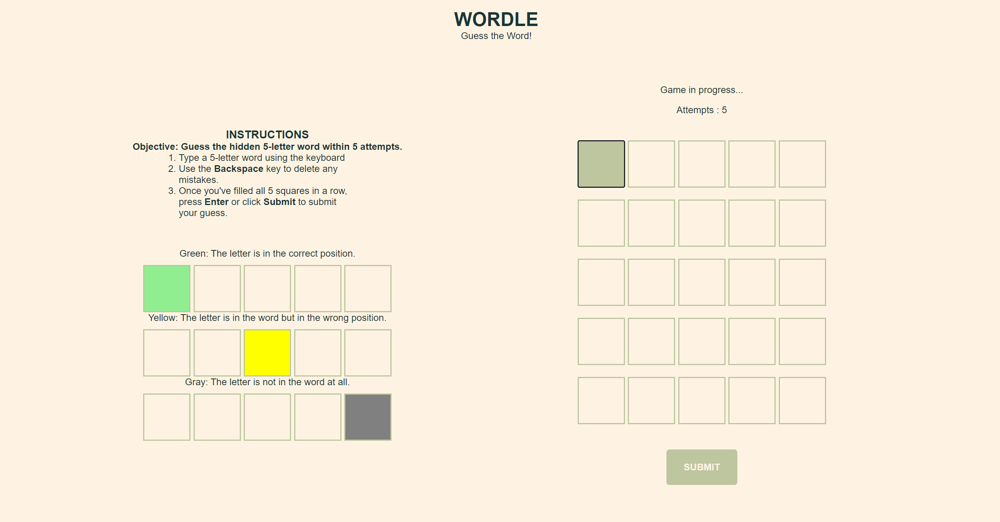

# <p align="center">WORDLE</p>


Wordle is a popular online word puzzle game where players have five attempts to guess a five-letter word. After each guess, the game provides feedback by highlighting letters in three possible colors:

Green: The letter is in the correct position.  
Yellow: The letter is in the word but in the wrong position.  
Gray: The letter is not in the word.  

Players use these clues to refine their guesses and ultimately find the correct word. Wordle became widely popular for its simplicity and daily challenge format, where a new word is available to guess each day.
## Visit at:
### https://tamerlanmustafayev.github.io/wordle-browser-game/

# Getting started:
1. As a user, I want to see clear instructions on how to play the Wordle game when the page loads.  
1. As a user, I want to be able to start the game by clicking 'New Game'.  
1. As a user, I want to see a grid of cells that can be clicked to guess the word.  
2. As a user, I want to be able to use my keyboard or an on-screen keyboard so that I can type my guess.  
1. As a user, I want to see letters that are in the correct place highlighted in green.  
1. As a user, I want to see letters that are misplaced but still exist in the target word highlighted in yellow.    
1. As a user, I want to see letters that do not exist in the target word highlighted in gray.  
1. As a user, I want to see a message when I correctly guess the target word within the first 5-7 attempts.  


```js 
PSEUDOCODE

// define a variable to set maximum attempts to 5-7
// define a variable to access grid elements
// define a variable called currentCell to store and modify clicked cell
// define a variable to store target word/words
// create an onscreen keyboard


// create a render function
// create an init function
// create a startNewGameFunction
// create a checkForMatch function to check the user guess against target word
// create handleClick function
// create updateBoard function to update UI on the page
// create updateMessage function to message win/fail
```


# Acknowledgments
- Special thanks to **[@chamer079](https://github.com/chamer079)** - for their support and experience.
- **ChatGPT** 

# Technologies used:

HTML, CSS,  JavaScript

# Next steps: 

1. Add New Game button 
2. Incorporate mobile-friendly layout
3. Add dark/light mode functionality
4. Expand target word base
5. Add multiplayer functionality

